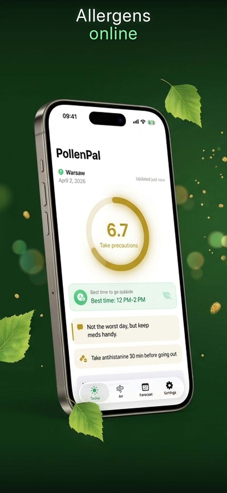
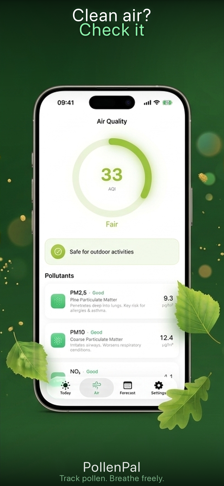
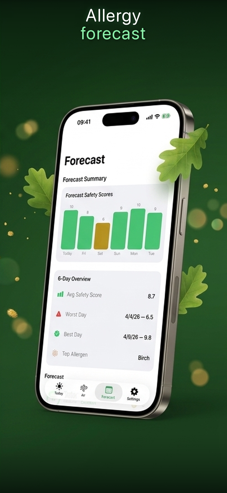

# 🌿 PollenPal: Allergy Forecast

Personal allergy safety score by YOUR allergens. Pollen + air quality on one screen.

## Download

**[App Store (iOS)](https://apps.apple.com/app/id6761559299)** — free, no ads, no subscription

**[Web version](https://magic-dev-kz.github.io/pollenpal/)** — single HTML file, works offline

## Screenshots

  
  
  

## Why PollenPal?

Most allergy apps show the same number for everyone. But if you're only allergic to birch — why worry about grass? PollenPal calculates a Safety Score (0–10) based only on the allergens that affect YOU.

## Features

- **Personal Safety Score** — 0–10 by your allergens: birch, grass, ragweed, mugwort, alder, olive
- **Best Hour to Go Outside** — when both pollen and air are safe
- **5-Day Forecast** — see which days are safe and which to avoid
- **Symptom Diary** — log sneezing, congestion, itchy eyes
- **Air Quality** — AQI, PM2.5 in real time
- **Morning Notifications** — daily push with your Safety Score
- **Safety Share Card** — share today's score in chats and Stories
- **Private** — no ads, no sign-up, your data never leaves your phone

## iOS App

Native SwiftUI app with full allergen profiling, symptom tracking, air quality monitoring, and push notifications. Data stored on device only.

- Requires iOS 17+
- Built with SwiftUI + Open-Meteo API

## Web Version

Single HTML file PWA — nothing to install, works offline, no accounts, no tracking. Your data stays in your browser (localStorage).

## Privacy

Location is used only to fetch local pollen data and is never stored on any server. You can enter your city manually. [Privacy Policy](https://mdk.guru/apps/pollenpal/privacy)

## Built by

One person + AI agents at [MDK.GURU](https://mdk.guru)

## License

MIT
